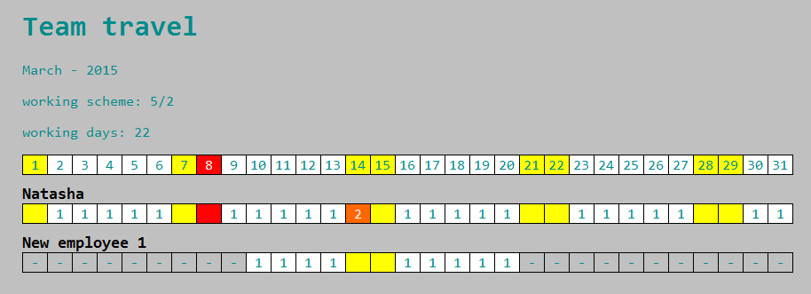

timesheet
=====

Sandbox application for playing with [Basis.js](https://github.com/basisjs) framework.

1. Server side - Node.js with Express.js
1. Database - sqlite
1. Client side - Basis.js

Functionality
-----

User should be able to fill timesheet of employees of his team. 

Demo:

<https://patgod85-timesheet.herokuapp.com/>