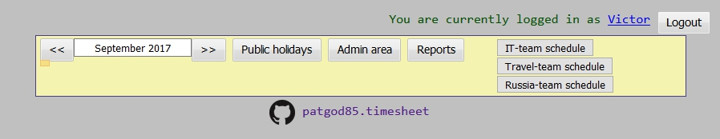
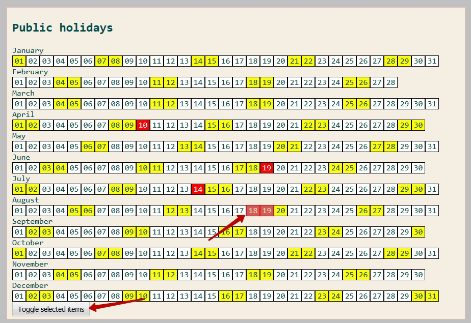
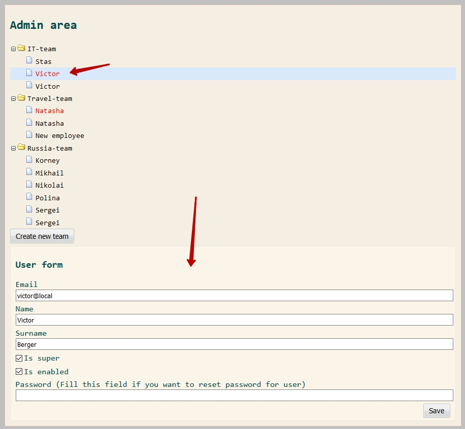
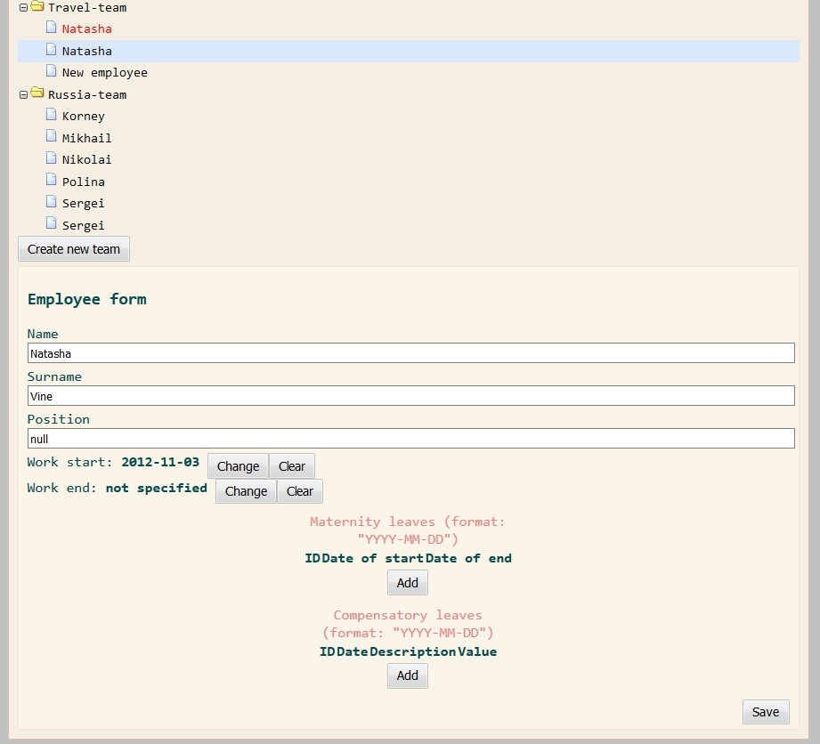
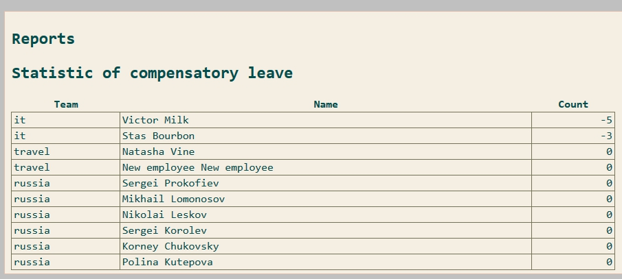
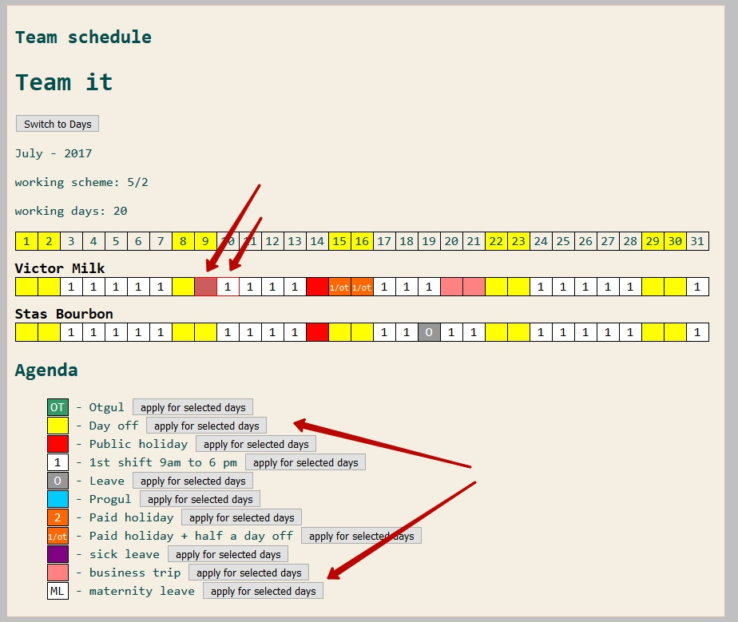
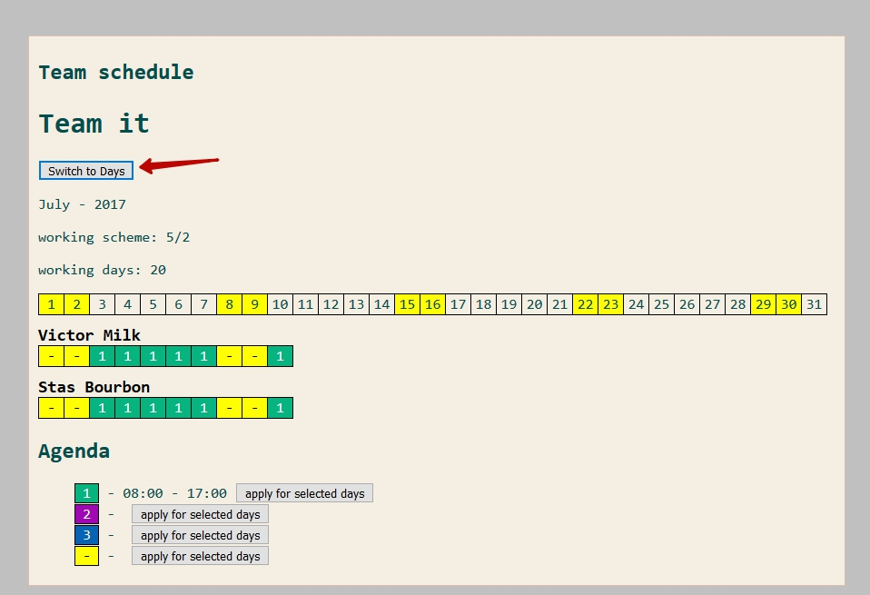
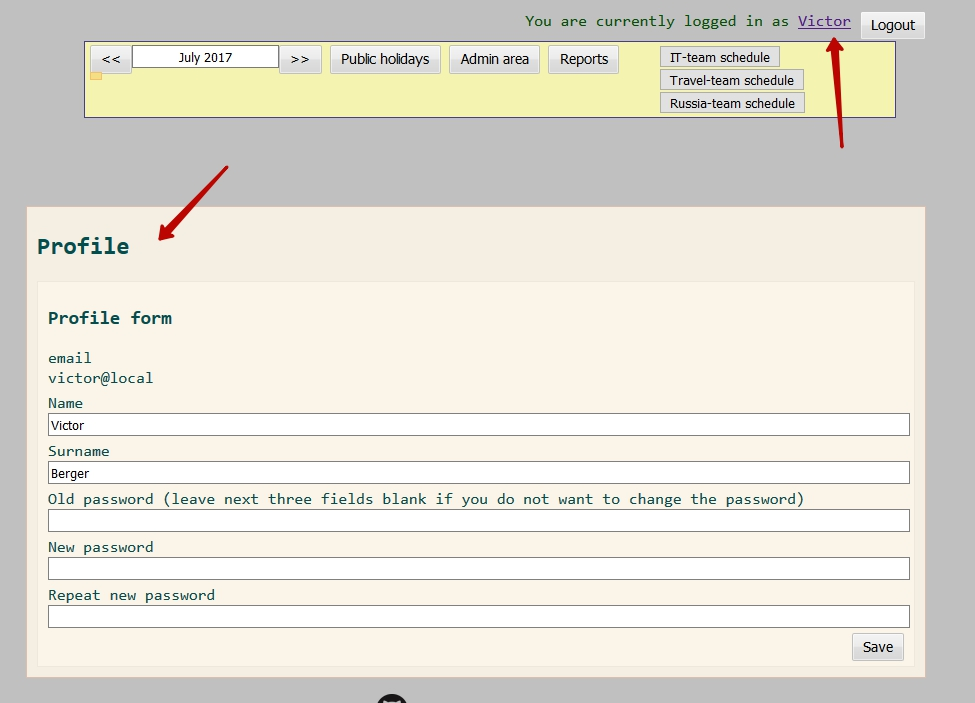

Documentation
---

The system works on <http://timesheet.devserver/> (for example)

To use the system a client should have a login and a password

After singin in client should see the main screen of the system

The main objective of the application is counting of working days for employees of company. There are several main features:

- Setting of [public holidays](#public-holidays) on the calendar of the year;
- [Admin area](#admin-area), there user with ADMIN_ROLE can manage staff and users;
- [Reporting](#reports) of compensatory leaves for employees
- Managing of the [Team schedule](#team). The team with calendars for each person for settings of day types
- Managing of client's [profile](#profile)

Public holidays 
---

On the page there is a calandar of the year. 
To change the year use the month datepicker at the top box (pick any month of the needed year). 
Every dates on the page's calendar is clickable. Pick the dates you want and submit "Toggle selected items" button. After some delay the picked dates should become "Red" it means that it is a public holiday now and the day will be not count as a working day.

Admin area 
---

In the admin area there is a tree of teams. Every team can have empoyees (black color) and users (red color). If you click onto Team, Employee or User then appropriate for will appear at the bottom of the page. An Admin (super user) can manage all teams other users can manage only their teams.

Employee can have array of compensatory leaves with notes. This items will be count during the [report](#reports) calculation. Use only latin symbols beacuse there is a known issue with cyrillic ones.

The same way can be added several maternity leaves.

Reports 
---

Simple statistic of compensatory leaves for every employee. System counts for the statistic this items:

 - Day type "Compensatory leave" (Отгул) -1
 - Day type "Paid holiday + half a day off" +1
 - Rows of Compensatory leaves from [Employee form](#admin-area) +Value

Team schedule 
---

Every cell in the report is clickable. Pick several dates and set a day type using one of buttons in the bottom of the form.

Using the button "switch to days" it's possible to switch the calendar to "shifts mode" or "day types mode".

Profile 
---

Using the link on the username it's possible to open the form for current user

